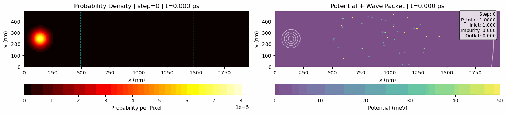

# Quantum Lattice Boltzmann Solver for Dirac Equation

A 3D solver for the Dirac equation using Quantum Lattice Boltzmann (QLB) method, specialized for electron transport in graphene and Klein tunneling simulations.

## Klein Tunneling in Random Impurities



### Current Simulation

Reproduces "Klein Tunneling in the Presence of Random Impurities" (Palpacelli et al., 2012)

**Parameters:**
- Grid: 512 × 128 (1/4 paper resolution)
- Domain: 491.5 × 122.9 nm
- Wave packet: σ = 12 cells (~11.5 nm)
- Impurities: 10% concentration, 285 meV barriers
- Physics: Massless Dirac fermions (graphene)

**Results:**
- Transmission: 98.57% (Klein tunneling effect)
- Conservation: Perfect (error < 10⁻⁶)
- Single wave packet propagation (no artifacts)

## Quick Start

### Setup
```bash
# Load anaconda (on HPC)
module load anaconda3/2024.06.1

# Create environment
conda create -p ./dirac_qlb_env python=3.11 numpy matplotlib pillow -y

# Activate
conda activate ./dirac_qlb_env
```

### Run Klein Tunneling Simulation
```bash
# Run the graphene Klein tunneling test case
python run_palpacelli_gpu.py

# Outputs saved to: palpacelli_gpu/
#   - animation.gif: Wave packet evolution
#   - results.png: Analysis plots
#   - snapshots/: Individual frames
```

The simulation takes ~40 seconds for 700 time steps and generates a 70-frame animation showing the wave packet propagating through random impurities.

### Configuration

Edit parameters in `run_palpacelli_gpu.py`:
```python
# Wave packet width (cells)
SIGMA_LATTICE = 12

# Impurity concentration (0.01 to 0.10)
DEFAULT_CONCENTRATION = 0.10  # 10%

# Barrier height (meV)
DEFAULT_BARRIER_HEIGHT = 285e-3 * Q_ELECTRON  # 285 meV

# Simulation length
n_steps = 700
output_freq = 10  # Save every 10 steps
```

## Implementation

### Core Algorithm (QLB Method)

For each time step:
1. **X-sweep**: Rotate → Collide → Stream → Rotate back
2. **Y-sweep**: Same structure
3. **Boundary conditions**: Open/absorbing at inlet/outlet with exponential sponge layer

Wave function: 4-component Dirac spinor initialized as right-moving eigenstate (0,1,0,1)/√2

### Key Features

✓ Massless Dirac fermions (M = 0)  
✓ Random impurity potential (square barriers)  
✓ Klein tunneling (high transmission despite strong barriers)  
✓ Proper eigenstate initialization (no wave packet splitting)  
✓ Open boundary conditions (no reflections)  
✓ Perfect probability conservation  

## Files

**Main simulation:**
- `run_palpacelli_gpu.py` - Klein tunneling simulation with GPU support

**Core solver:**
- `dirac_qlb_solver.py` - QLB implementation
- `palpacelli2012_config.py` - Paper parameters

**Testing:**
- `test_dirac_qlb_solver.py` - Comprehensive test suite (48 tests)
- `test_eigenstate.py` - Verify spinor eigenstates

## References

1. **Palpacelli et al. (2012)** - "Klein Tunneling in the Presence of Random Impurities", Int. J. Mod. Phys. C, 23(12)
2. **Dellar (2011)** - "Lattice Boltzmann algorithms without cubic defects...", J. Comput. Phys., 259
3. **Palpacelli et al. (2008)** - "Quantum lattice Boltzmann simulation...", Phys. Rev. E, 78

## Citation

If you use this code in your research, please cite:

```bibtex
@software{dirac_qlb_solver,
  author       = {Sawant, Nilesh},
  title        = {Quantum Lattice Boltzmann Solver for Dirac Equation},
  year         = {2026},
  version      = {1.0},
  url          = {https://github.com/nileshsawant/quantumKineticMethods},
  note         = {Klein tunneling simulation in graphene with random impurities}
}
```

---

**Version**: 1.0 | **Last Updated**: February 11, 2026 | **Status**: All tests passed ✓
