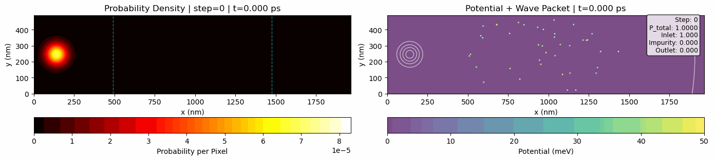

# Quantum Kinetic Solver for the Dirac Equation

Simulates relativistic quantum wave packets in graphene using the Quantum Lattice
Boltzmann (QLB) method.  The current test case reproduces Fig. 8 of Palpacelli
et al. (2012): a massless Dirac fermion wave packet propagating through a
two-dimensional disordered medium and fragmenting into a plane front via Klein
tunneling.



---

## Table of Contents

1. [Physical Background](#1-physical-background)
2. [The Dirac Equation in Graphene](#2-the-dirac-equation-in-graphene)
3. [Quantum Lattice Boltzmann Method](#3-quantum-lattice-boltzmann-method)
4. [Operator Splitting (3D → three 1D sweeps)](#4-operator-splitting)
5. [Collision and Streaming Steps](#5-collision-and-streaming-steps)
6. [Boundary Conditions](#6-boundary-conditions)
7. [Wave Packet Initialisation](#7-wave-packet-initialisation)
8. [Simulation Parameters](#8-simulation-parameters)
9. [Quick Start](#9-quick-start)
10. [File Structure](#10-file-structure)
11. [References](#11-references)

---

## 1. Physical Background

### Klein Tunneling

In ordinary quantum mechanics a particle with energy $E$ impinging on a potential
barrier of height $V > E$ is exponentially reflected — tunnelling probability
decays as $e^{-\kappa d}$ with barrier thickness $d$.

For **relativistic** Dirac fermions the situation is completely different.  When
$V > E + mc^2$ the transmitted wave outside the barrier is again a positive-energy
solution but with opposite chirality, so the barrier becomes **perfectly
transparent** at normal incidence.  This is the *Klein paradox* (O. Klein, 1929).

In **graphene** the low-energy charge carriers obey a 2D massless Dirac equation
with the Fermi velocity $v_F \approx 10^6\ \text{m/s}$ playing the role of the
speed of light.  They therefore exhibit near-perfect Klein tunneling, which is the
main obstacle to building a graphene transistor (the gate voltage cannot stop the
current).

### Random Impurities

Palpacelli et al. (2012) study a Gaussian wave packet travelling through a region
filled with randomly placed square potential barriers (impurities) of side $d$ and
height $V$.  Three physical regimes exist for massless particles ($m = 0$):

| Regime | Condition | Observed behaviour |
|--------|-----------|-------------------|
| Weak potential | $V < E$ | Packet slows slightly, minor splitting |
| Intermediate | $V \approx E$ | Significant scattering and fragmentation |
| Strong (Klein) | $V \gg E$ | Near-perfect transmission via Klein tunneling |

For $C = 0.5\%$, $V = 50\ \text{meV}$, $E = 80\ \text{meV}$ (Fig. 8 of the
paper), the packet is in the weak-to-intermediate regime.  It fragments into a
spreading plane front as each impurity individually redirects part of the wave.

---

## 2. The Dirac Equation in Graphene

### Standard Form

The single-particle Dirac equation is

$$\left(\partial_t + c\,\boldsymbol{\alpha}\cdot\nabla\right)\psi
  = -i\omega_c\,\beta\,\psi + ig\,\psi, \qquad (1)$$

where:

- $\psi$ is a **4-component complex spinor** (the wave function),
- $c$ is the speed of light (replaced by $v_F$ in graphene),
- $\omega_c = mc^2/\hbar$ is the Compton frequency ($= 0$ for massless graphene fermions),
- $g = qV/\hbar$ is the dimensionless coupling to a scalar potential $V$
  ($q = e$ = electron charge),
- $\boldsymbol{\alpha} = (\alpha_x, \alpha_y, \alpha_z)$ and $\beta$ are the
  $4\times 4$ Dirac matrices (defined in `dirac_qlb_solver.py`).

### Majorana Form

Following Dellar (2011) Eq. 6, we apply a unitary Majorana transformation
$U = (\alpha_y + \beta)/\sqrt{2}$ to obtain an equivalent form where all three
streaming matrices are **real**:

$$\left[\partial_t + c\!\left(-\alpha_x\partial_x + \beta\partial_y - \alpha_z\partial_z\right)
  + i\omega_c\alpha_y - igI\right]\psi = 0.$$

In this form the streaming matrix along $y$ is **$\beta$**, which is already diagonal:

$$\beta = \mathrm{diag}(1, 1, -1, -1).$$

This property is what makes a clean operator splitting possible (see §4).

### Graphene Specifics

In a 2D graphene sheet only two spatial dimensions matter ($x$ = propagation
direction, $y$ = transverse).  The Fermi velocity $v_F \approx 10^6\ \text{m/s}$
replaces $c$ everywhere.  This sets the natural energy scale:

$$\Delta E = \frac{\hbar}{\Delta t} = \frac{\hbar v_F}{\Delta x}
  \approx 686\ \text{meV} \quad \text{for } \Delta x = 0.96\ \text{nm}.$$

A wave packet with lattice momentum $k_0\Delta x = 0.117$ therefore has kinetic energy

$$E = \hbar v_F k_0 = 0.117 \times 686\ \text{meV} \approx 80\ \text{meV},$$

matching Table 1 of Palpacelli (2012).

---

## 3. Quantum Lattice Boltzmann Method

### Analogy with Classical LBM

The classical lattice Boltzmann method solves the Navier–Stokes equations by
tracking discrete distribution functions $f_i$ that stream along lattice links
and collide locally.  The QLB method exploits the structural similarity:

| Classical LBM | Quantum LBM |
|---------------|-------------|
| Distribution functions $f_i(\mathbf{x}, t)$ | Spinor components $\psi_i(\mathbf{x}, t)$ |
| Discrete velocities $\boldsymbol{\xi}_i$ | Streaming matrices $\alpha_x, \beta, \alpha_z$ |
| Collision operator (BGK) | Unitary collision matrix $\hat{Q}$ |
| Conservation of mass/momentum | Conservation of probability (unitarity) |

The crucial difference: the QLB collision is **unitary** (not dissipative), so
total probability $\int|\psi|^2\,dV$ is exactly conserved at every time step.

### One-Dimensional QLB Step

In 1D along $z$, the Majorana-form Dirac equation for the rotated spinor
$Z^{-1}\psi = (u_1, u_2, d_1, d_2)^T$ decouples into characteristics
(Dellar 2011, Eq. 15):

$$\partial_t u_{1,2} + c\,\partial_z u_{1,2} = \omega_c d_{2,1} + ig\,u_{1,2},$$
$$\partial_t d_{1,2} - c\,\partial_z d_{1,2} = -\omega_c u_{2,1} + ig\,d_{1,2}.$$

Here **$u$ components travel right** ($+z$) and **$d$ components travel left**
($-z$) along the light cones $z \pm ct$.  Integrating along characteristics and
discretising the source term with the trapezoid rule gives (Palpacelli 2012, Eq. 7):

$$\hat{u}_{1,2} = a\,u_{1,2} + b\,d_{2,1}, \qquad
  \hat{d}_{1,2} = a\,d_{1,2} - b\,u_{2,1},$$

where the complex **collision coefficients** are (Palpacelli 2012, Eq. 8):

$$a = \frac{1 - \Omega/4}{1 + \Omega/4 - i\tilde{g}}, \qquad
  b = \frac{\tilde{m}}{1 + \Omega/4 - i\tilde{g}}, \qquad
  \Omega = \tilde{m}^2 - \tilde{g}^2,$$

$$\tilde{m} = \omega_c\Delta t = \frac{mc^2\Delta t}{\hbar}, \qquad
  \tilde{g} = g\Delta t = \frac{V_\text{energy}\,\Delta t}{\hbar}
  \quad (V_\text{energy} = qV_\text{volts}\ [\text{J}]).$$

Unitarity $|a|^2 + |b|^2 = 1$ holds exactly.
In matrix form (Dellar 2011, Eq. 19) this is the collision matrix $Q$:

$$Q = \begin{pmatrix}
a & 0 & 0 & b \\
0 & a & b & 0 \\
0 & -b & a & 0 \\
-b & 0 & 0 & a
\end{pmatrix}.$$

The full 1D step is therefore:
1. **Rotate** $\psi$ into the characteristic frame: $\tilde\psi = Z^{-1}\psi$
2. **Collide**: apply the $2\times 2$ collision pairs to $(\tilde{u}, \tilde{d})$
3. **Stream**: shift $u$ components one cell to the right, $d$ one cell to the left
4. **Rotate back**: $\psi = Z\,\tilde\psi$

---

## 4. Operator Splitting

### Why It Is Needed

The three streaming matrices $\alpha_x$, $\beta$, $\alpha_z$ do not commute
(they contain non-commuting Pauli matrices), so there is **no single change of
basis that diagonalises all three simultaneously**.  We therefore use
**Lie–Trotter operator splitting** to approximate the 3D evolution by three
sequential 1D sweeps:

$$\psi(t+\Delta t) \approx e^{\Delta t \mathcal{L}_x}\,e^{\Delta t \mathcal{L}_y}\,
  e^{\Delta t \mathcal{L}_z}\,\psi(t) + O(\Delta t^2),$$

where each $\mathcal{L}_\alpha$ contains the spatial derivative in that direction
**plus one-third of the collision term**.

### The Three Sweeps (Palpacelli 2012, Sec. 2)

Each sweep is self-contained — it starts from and returns to the physical spinor basis:

| Sweep | Rotation matrix | Streaming direction | BCs |
|-------|----------------|---------------------|-----|
| X-sweep | $X$, $X^{-1}$ | $\pm x$ (propagation) | Open (inlet bounce-back / outlet absorbing) |
| Y-sweep | $Y = I$ (identity) | $\pm y$ (transverse) | Periodic |
| Z-sweep | $Z$, $Z^{-1}$ | $\pm z$ | Periodic |

All three sweeps are always executed.  For the 2D Palpacelli test case NZ = 1
so the Z-streaming is the identity (one cell wraps back to itself), but the
Z-sweep still applies one-third of the collision operator — omitting it would
reduce the effective barrier coupling to 2/3 of its specified value.  The rotation matrices are
(Dellar 2011, Eqs. 10 and 22):

$$X = \frac{1}{\sqrt{2}}\begin{pmatrix}
-1 & 0 & 1 & 0 \\
0 & 1 & 0 & -1 \\
1 & 0 & 1 & 0 \\
0 & 1 & 0 & 1
\end{pmatrix}, \qquad
Z = \frac{1}{\sqrt{2}}\begin{pmatrix}
0 & -1 & 0 & 1 \\
1 & 0 & -1 & 0 \\
0 & 1 & 0 & 1 \\
1 & 0 & 1 & 0
\end{pmatrix}, \qquad Y = I.$$

$X$ diagonalises $-\alpha_x$ to $\mathrm{diag}(+1,+1,-1,-1)$, so after
rotating with $X^{-1}$ the first two components travel in $+x$ and the last two
in $-x$.  Since $\beta$ is already diagonal, $Y = I$ needs no rotation.

**The isotropy fix (Dellar 2011):** each sweep must end by rotating **back** to
the physical basis before the next sweep begins.  Earlier QLB formulations omitted
this, causing non-commuting rotations to accumulate across sweeps and producing
severe anisotropy that did not converge under grid refinement.

### Collision Matrix in 3D

In 3D the collision term is split equally among the three sweeps, each using
one-third of the time step.  The resulting 3D collision matrix $\hat{Q}$ has
the sign pattern of $\alpha_y$ (Palpacelli 2012, Eq. 10):

$$\hat{Q} = \begin{pmatrix}
\hat{a} & 0 & 0 & -\hat{b} \\
0 & \hat{a} & \hat{b} & 0 \\
0 & -\hat{b} & \hat{a} & 0 \\
\hat{b} & 0 & 0 & \hat{a}
\end{pmatrix},$$

where $\hat{a}, \hat{b}$ use rescaled coefficients with $\Delta t/3$
instead of $\Delta t$.

A key identity (Dellar 2011, Sec. IV): *"$X^{-1}\hat{Q}X$ and $Z^{-1}\hat{Q}Z$
have the same sign pattern as $Q$, but $\hat{Q}$ itself does not."*

This means the code must:
- In the **Y-sweep** (no rotation, $Y = I$): collide with $\hat{Q}$ sign pattern
  — the off-diagonal $\hat{b}$ coupling between $u_1 \leftrightarrow d_2$ carries
  a **minus** sign.
- In the **X/Z-sweep** (rotated frame): the effective collision is
  $X^{-1}\hat{Q}X$, which has the **$Q$ sign pattern** — the $b$ coupling carries
  a **plus** sign.

For massless graphene fermions ($m = 0$) the mass coefficient $b = 0$, so the
distinction is invisible and both sweeps reduce to a pure phase rotation.

---

## 5. Collision and Streaming Steps

### Collision Coefficients (per sweep, at each grid cell)

$$\tilde{m}_3 = \frac{1}{3}\frac{mc^2\Delta t}{\hbar}, \qquad
  \tilde{g}_3 = \frac{1}{3}\frac{V_\text{energy}\,\Delta t}{\hbar},$$

where `V_field` stores **potential energy in Joules** ($= q \times V_\text{volts}$).
The factor $q$ must **not** appear again in the formula.

$$\Omega_3 = \tilde{m}_3^2 - \tilde{g}_3^2, \qquad
  D = 1 + \tfrac{\Omega_3}{4} - i\tilde{g}_3,$$

$$\hat{a} = \frac{1 - \Omega_3/4}{D}, \qquad \hat{b} = \frac{\tilde{m}_3}{D},
  \qquad |\hat{a}|^2 + |\hat{b}|^2 = 1.$$

For the paper's parameters ($V = 50\ \text{meV}$, $\Delta t = 9.6\times10^{-16}\ \text{s}$):

$$\tilde{g}_3 = \frac{50 \times 10^{-3} \times 1.6\times10^{-19} \times 9.6\times10^{-16}}
  {3 \times 1.055\times10^{-34}} \approx 0.024.$$

### Streaming Rule

After collision the characteristic components are shifted exactly one lattice cell:

```
u₁, u₂  →  cell + 1   (right-movers, propagate in + direction)
d₁, d₂  →  cell - 1   (left-movers,  propagate in - direction)
```

This is **exact and diffusion-free** because the lattice spacing was chosen to
equal one light-cone step: $\Delta x = v_F \Delta t$.  No fractional transport
and no numerical diffusion are introduced.

---

## 6. Boundary Conditions

### Inlet ($x = 0$) — Bounce-Back

The left boundary reflects left-moving characteristic components back as
right-movers, mimicking a hard wall.  In the $X$-characteristic frame:

```
u₁ ← d₁,   u₂ ← d₂,   then set d₁ = d₂ = 0
```

This conserves probability perfectly (the reflected energy stays in the domain)
and prevents the source from emitting backward-travelling waves.

### Outlet ($x = N_x - 1$) — Open / Absorbing

Any backward-travelling components arriving at the outlet are discarded:

```
d₁ = 0,   d₂ = 0
```

An **exponential sponge layer** over the last 20 cells gradually damps the wave
amplitude before it reaches this edge, preventing abrupt truncation artefacts
while the outgoing wave exits cleanly.

### Top/Bottom Boundaries ($y$) — Periodic

The Y-sweep uses wrap-around streaming, equivalent to an infinite graphene ribbon:

```
u at y = 0      ←  u from y = N_y - 1
d at y = N_y-1  ←  d from y = 0
```

---

## 7. Wave Packet Initialisation

The initial state is a 2D Gaussian wave packet with carrier wave vector
$\mathbf{k}_0 = k_0\, \hat{x}$ (head-on incidence, no $y$-momentum), following
Palpacelli 2012, Eq. 11:

$$\psi_l(x, y) = \frac{A_l}{(4\pi\sigma^2)^{1/2}}\,
  e^{-[(x-x_0)^2 + (y-y_0)^2]/(4\sigma^2)}\,
  e^{ik_0 x}, \qquad l = 1, 2,$$

with $A_1 = A_2 = 1/\sqrt{2}$ for head-on incidence.

In the 4-component Dirac spinor this is set as:

```python
psi[:,:,:,1] = amplitude / sqrt(2)   # spinor component index 1
psi[:,:,:,3] = amplitude / sqrt(2)   # spinor component index 3
```

One can verify via $X^{-1}\psi = (u_1, u_2, d_1, d_2)^T$ that this choice maps
to $(0, 1, 0, 0)$ in the $X$-characteristic frame — a **pure right-mover** with
zero left-moving content.  Initialising with any left-moving component causes the
wave packet to immediately split: one half propagates forwards and one backwards.
This is an initialisation artefact and is absent from this choice.

The wave packet centre is placed at $x_0 = 3\sigma$ from the inlet so that the
Gaussian tail is negligible at the left boundary from the start.

---

## 8. Simulation Parameters

All parameters reproduce Section 4 of Palpacelli et al. (2012) exactly.

| Parameter | Symbol | Value | Physical meaning |
|-----------|--------|-------|-----------------|
| Grid size | $N_x \times N_y$ | 2048 × 512 | Full paper resolution |
| Lattice spacing | $\Delta x$ | 0.96 nm | Resolves $\sigma = 48$ and $d = 8$ |
| Fermi velocity | $v_F$ | $10^6$ m/s | Effective speed of light in graphene |
| Time step | $\Delta t = \Delta x / v_F$ | $9.6 \times 10^{-16}$ s | Light-cone condition |
| Energy unit | $\Delta E = \hbar/\Delta t$ | 686 meV | Natural energy scale |
| Wave-packet energy | $E = k_0 \Delta E$ | 80 meV | Kinetic energy |
| Lattice momentum | $k_0 \Delta x$ | 0.117 | $E/\Delta E$ |
| Wave-packet spread | $\sigma$ | 48 cells (46 nm) | Spatial extent in $x$ and $y$ |
| Particle mass | $m$ | 0 | Massless graphene fermions |
| Impurity size | $d$ | 8 cells (7.7 nm) | Square-barrier side length |
| $\sigma/d$ ratio | — | 6 | Packet wider than each impurity |
| Concentration | $C$ | 0.5% | Fraction of impurity-region area covered |
| Barrier height | $V$ | 50 meV | $< E$: weak-potential regime |
| Steps simulated | — | 1800 | First 1.73 ps; matches Fig. 8 of paper |
| Output frequency | — | every 50 steps | 36 snapshot frames |

### Domain Layout

```
x:  [0 ────── 512)  [512 ──────────── 1536)  [1536 ──── 2048]
       INLET              IMPURITIES             OUTLET
    wave packet  bounce-back at x=0  random     transmitted
     starts here          ←          barriers   wave measured
```

### Diffraction Estimate

A Gaussian beam of width $\sigma$ and carrier wavevector $k_0$ diffracts at
half-angle $\theta \approx 1/(\sigma k_0)$.  For $\sigma = 48$, $k_0\Delta x = 0.117$:

$$\theta \approx \frac{1}{48 \times 0.117} \approx 0.178\ \text{rad} \approx 10°.$$

Over the 512-cell inlet region the beam spreads transversely by
$\approx 512\tan(10°) \approx 90$ cells — about 18% of $N_y = 512$.  The beam
arrives at the impurity region as a well-collimated Gaussian, consistent with
Fig. 8 of the paper.

---

## 9. Quick Start

### Environment Setup

```bash
# On the HPC cluster
module load anaconda3/2024.06.1

# GPU environment (recommended — ~16× faster for 2048×512)
conda activate /kfs2/projects/hpcapps/nsawant/qcBac/lbmQC/envs/q_gpu

# CPU-only fallback
conda create -p ./dirac_qlb_env python=3.11 numpy matplotlib pillow -y
conda activate ./dirac_qlb_env
```

### Run the Simulation

```bash
# Request interactive GPU node
srun --pty --gres=gpu:1 -N1 -n1 bash

# Run
python run_palpacelli_gpu.py
```

Outputs are written to `palpacelli_gpu/`:
```
palpacelli_gpu/
  snapshots/      36 PNG frames (step 0, 50, 100, ..., 1750)
  animation.gif   Animated wave-packet evolution (200 ms per frame)
  results.png     Regional probabilities, transmission, conservation error
```

### Changing Parameters

Edit the configuration block near the top of `run_palpacelli_gpu.py`:

```python
DEFAULT_CONCENTRATION = 0.005    # impurity area fraction (try 0.001 to 0.05)
DEFAULT_BARRIER_HEIGHT = 50e-3 * Q_ELECTRON  # barrier potential energy in Joules
M_PARTICLE = 0.0                 # 0 = massless (graphene); 0.1*HBAR/DT/V_F**2 for massive
K0_LATTICE = 0.117               # lattice momentum → sets wave packet energy
SIGMA_LATTICE = 48               # wave-packet width in lattice cells
```

---

## 10. File Structure

| File | Purpose |
|------|---------|
| `run_palpacelli_gpu.py` | Main simulation: impurity generation, wave-packet IC, time loop, BCs, plotting |
| `dirac_qlb_solver.py` | Rotation matrices $X$, $Y$, $Z$; Dirac $\alpha$/$\beta$ matrices; standalone 1D QLB solver |
| `test_dirac_qlb_solver.py` | Unit tests for the solver |
| `palpacelli2012.md` | Paper converted to Markdown (reference) |
| `dellar2011.md` | Paper converted to Markdown (reference) |
| `palpacelli2008.md` | Paper converted to Markdown (reference) |

---

## 11. References

1. **Palpacelli, S., Falcucci, G., & Succi, S. (2012)**
   "Klein Tunneling in the Presence of Random Impurities."
   *Int. J. Mod. Phys. C*, 23(12), 1250080.
   *(Provides the simulation setup reproduced here: Fig. 8, domain layout,
   impurity model, boundary conditions, wave-packet parameters.)*

2. **Dellar, P. J., Lapitski, D., Palpacelli, S., & Succi, S. (2011)**
   "Isotropy of three-dimensional quantum lattice Boltzmann schemes."
   *Phys. Rev. E*, 83, 046706.
   *(Derives the correct rotation matrices $X$, $Z$ and the collision matrices
   $Q$, $\hat{Q}$; fixes the isotropy bug of earlier QLB formulations.)*

3. **Palpacelli, S., & Succi, S. (2008)**
   "Quantum lattice Boltzmann simulation of expanding Bose–Einstein condensates."
   *Phys. Rev. E*, 77, 066708.
   *(Original 1D QLB formulation and benchmark tests.)*

---

## Citation

```bibtex
@software{dirac_qlb_solver,
  author  = {Sawant, Nilesh},
  title   = {Quantum Kinetic Solver for the Dirac Equation},
  year    = {2026},
  url     = {https://github.com/nileshsawant/quantumKineticMethods},
  note    = {Reproduces Klein tunneling in graphene with random impurities}
}
```

---

*Last updated: March 2026*
