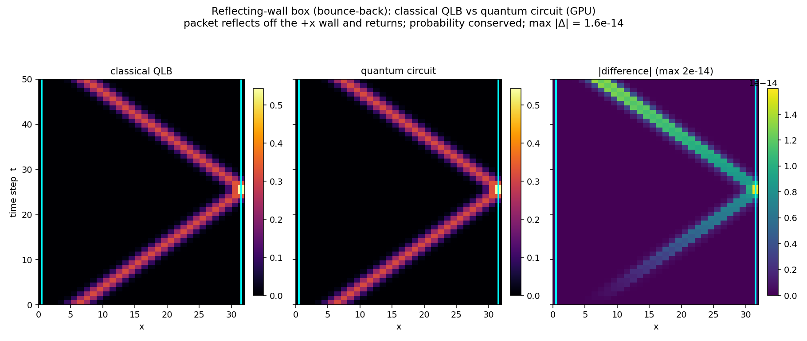
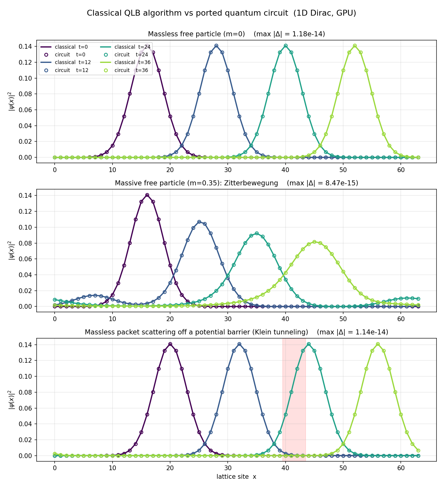
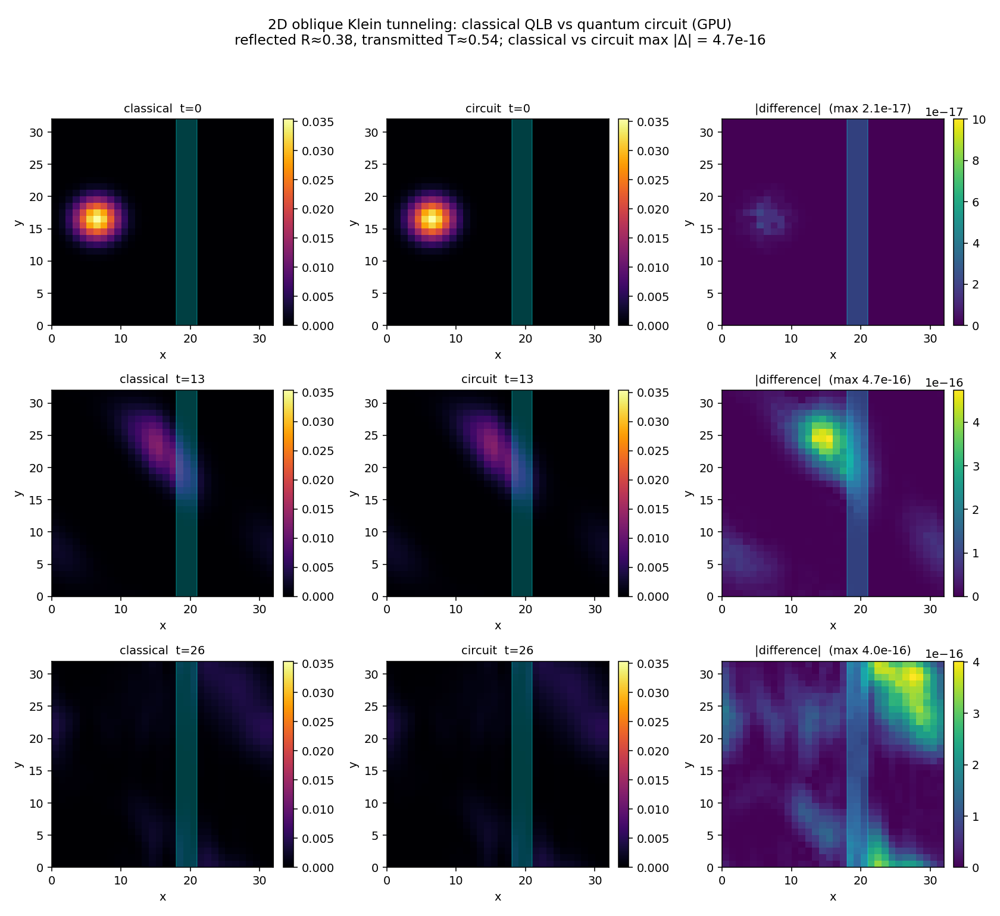
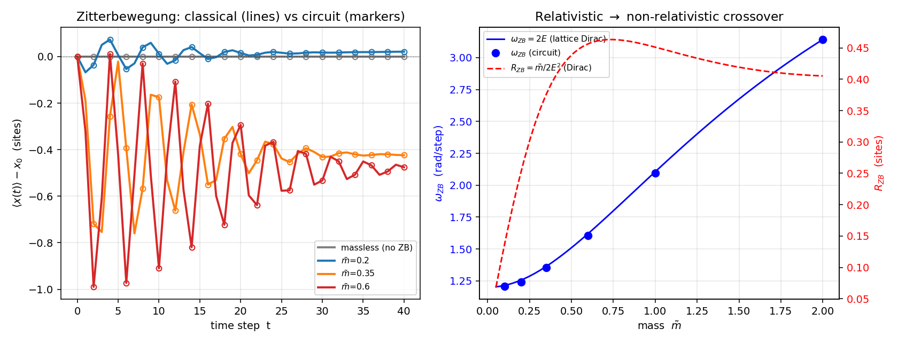

# quantumKineticMethods

**Exact quantum circuits for the quantum lattice Boltzmann (QLB) method for the Dirac equation.**

[](https://nileshsawant.github.io/quantumKineticMethods/)

This repository ports the three-dimensional Succi–Dellar Dirac QLB scheme, operation by
operation, to **exact quantum circuits** on qubits, and verifies on a state-vector emulator
that the circuits reproduce the classical QLB solver to machine precision. It is the companion
code to the paper *Exact quantum circuits for the quantum lattice Boltzmann method for the
Dirac equation*.

A QLB time step is a fixed sequence of **unitary** operations — a basis rotation, a collision,
a streaming shift, and the inverse rotation — so it maps naturally onto a quantum circuit. Here
that mapping is made explicit and checked, layer by layer, against a classical reference.



*An oblique massless Dirac packet launched from a corner of a 32³ box bounces off all three
reflecting walls and returns. The ported circuit (cyan contours) matches the classical solver
(filled colour) to max|Δρ| = 6.7×10⁻¹⁷, with probability conserved.*

## What it does

- **Amplitude encoding.** The four Dirac spinor components live in 2 shared "spinor" qubits;
  each lattice axis of $N$ sites is addressed by $\log_2 N$ "position" qubits. A $32^3$ lattice
  ($32{,}768$ sites) is 17 qubits.
- **Every operation as a gate circuit.** The fixed rotations and the two-qubit collision (via
  the KAK decomposition); streaming as a **controlled increment** of the position register; the
  position-dependent potential as a **phase oracle** (massless) or a **position-multiplexed
  collision** (massive); and periodic and reflecting (bounce-back) boundaries as unitary
  circuits.
- **Composition.** Single-axis sweeps are tensored — one position register per axis on a shared
  spinor register — into 1D, 2D and 3D time steps.
- **A general harness.** A small "unitary → verified circuit" routine compiles any target
  unitary to a chosen gate set and independently checks it against its classical matrix.

No claim of computational advantage is made. The contribution is exact representability,
together with measured gate counts and a validated, reusable set of circuit primitives.

## Two ideas worth a look

- **Streaming is $+1$ on the position register.** Moving every amplitude one site is the map
  $|x\rangle \mapsto |x+1\rangle$, i.e. binary "add one" — a ripple of multi-controlled-X gates
  on the address bits, applied to all sites at once.
- **Bounce-back is $+1$ on a *folded* ring.** Folding the direction qubit into the position
  register as its most significant bit turns a hard-wall reflection into a single plain
  increment: interior movers advance one site, and a mover that reaches a wall crosses the fold
  and returns with its direction reversed. One increment does advection and reflection at once.

## Validation

Circuit vs. classical solver, maximum density deviation over all sites and recorded times
(state fidelity is 1 to twelve digits throughout):

| Test | Lattice (qubits) | Physics | max\|Δρ\| |
|---|---|---|---|
| 1D free / barrier / phase | $2^6$ line (8) | massless & massive | $3.7\times10^{-12}$ |
| 2D oblique Klein | $2^5\times2^5$ (12) | massless barrier | $4.7\times10^{-16}$ |
| 3D diagonal mover | $2^4\times2^4\times2^4$ (14) | massless free | $1.0\times10^{-17}$ |
| 3D reflecting box | $2^5\times2^5\times2^5$ (17) | massless, bounce-back | $6.7\times10^{-17}$ |

<p align="center">
  
  
</p>

*Left: 1D — Klein transmission of a massless packet through a barrier, the phase the barrier
imprints, massive-particle Zitterbewegung, and massive-barrier reflection. Right: 2D — a
massless packet at oblique incidence on a barrier splits into reflected and transmitted lobes.
Classical solver and circuit coincide in every panel.*

## Zitterbewegung and the trapped-ion comparison

Gerritsma *et al.* ([*Nature* **463**, 68 (2010)](https://doi.org/10.1038/nature08688)) simulated
the 1+1D Dirac equation on a single trapped ion and observed **Zitterbewegung** — the trembling
motion of a relativistic wave packet — together with the crossover from relativistic to
non-relativistic behaviour. That **analog** experiment is reproduced here **digitally**: the same
circuit construction advances the 1+1D Dirac dynamics, and because the ported circuit equals the
classical solver exactly, the two are run side by side.

On a 256-site line (10 qubits) at fixed carrier momentum, the mass is swept so that $mc^2$ crosses
$pc$ through the crossover. Two observables are read off the evolving packet:

- the **trembling frequency** $\omega_{\mathrm{ZB}} = 2E$, which follows the exact lattice
  dispersion and rises with the mass — a massless packet does not tremble at all, since $\alpha_x$
  is then conserved;
- the **position amplitude** $R_{\mathrm{ZB}} = \hat{b}/(2E\sin E)$, which grows from zero, peaks
  near $\tilde{m} \approx 0.7$, and dies away in both the ultrarelativistic and non-relativistic
  limits — the same crossover Gerritsma *et al.* report.

Across the whole sweep the ported circuit reproduces the classical solver to
$\max|\Delta\rho| \le 2.3\times10^{-13}$ at unit state fidelity.

<p align="center">
  
</p>

*Left: the mean position of a massless packet (flat) and three massive packets, which tremble and
then relax to a drift as their ±E branches separate. Right: the measured trembling frequency
(filled points) tracking 2E, and the position amplitude (open squares) tracking the exact
b̂/(2E·sin E) curve, rising to a maximum near m̃ ≈ 0.7 and falling off in both limits.*

Regenerate it with `python -m qlb_port.plot_validation_zitterbewegung`.

## Repository layout

```
qlb_port/                 circuit library
  operators.py            Dirac matrices, rotations, collision (Majorana form)
  streaming.py            streaming as a controlled increment; bounce-back (folded ring)
  potential.py            phase oracle / position-multiplexed collision
  sweep.py                one single-axis QLB substep (rotate – collide – stream – rotate)
  twod.py, threed.py      2D / 3D time steps from tensored position registers
  port.py                 "unitary -> verified circuit" harness (compile + check)
  backend.py              Qiskit Aer state-vector emulator interface
  test_port.py            every operator and composition checked vs its classical matrix
  plot_validation*.py     regenerate the validation figures
  validation_*.png        the figures shown above
dirac_qlb_solver.py       classical QLB Dirac solver (the reference the circuits are checked against)
test_qlb_validation.py    physics validation of the solver against the exact Dirac equation
test_dirac_qlb_solver.py  solver unit tests
```

## Quick start

```bash
pip install numpy scipy matplotlib qiskit qiskit-aer   # use qiskit-aer-gpu for the large circuits
```

```bash
# circuits reproduce the classical scheme (fast, runs on CPU)
python -m qlb_port.test_port

# physics validation of the classical solver vs the exact Dirac equation
python test_qlb_validation.py

# regenerate the 1D / 2D / 3D validation figures
python -m qlb_port.plot_validation
python -m qlb_port.plot_validation_2d
python -m qlb_port.plot_validation_3d

# reproduce the Zitterbewegung / trapped-ion comparison
python -m qlb_port.plot_validation_zitterbewegung
```

The larger circuits (for example the 17-qubit reflecting box) are emulated fastest on a GPU
through `qiskit-aer-gpu`.

## The scheme, in one paragraph

The state is a four-component Dirac spinor on a lattice. Following Dellar (2011), the scheme
uses the **Majorana form** of the Dirac equation, in which the three matrices multiplying the
spatial derivatives are real, so each spatial gradient becomes a $\pm1$ lattice shift after a
fixed spinor rotation. A time step is split into per-axis substeps; each rotates into the
characteristic frame, applies the $\mathrm{SU}(2)$ collision that carries the mass and the
potential, streams by one site, and rotates back. Every factor is unitary, so the discrete
$\ell_2$ norm of the field is conserved exactly — which is precisely what a quantum circuit on
$n$ qubits implements.

## Reference

This code accompanies the paper below. Please cite it if you use this repository.

Sawant, N. et al. (2026) “Exact quantum circuits for lattice Boltzmann realization of the Dirac equation.” arXiv. Available at: https://doi.org/10.48550/ARXIV.2608.06570.

## License

This project is released under the [Apache License 2.0](LICENSE).
